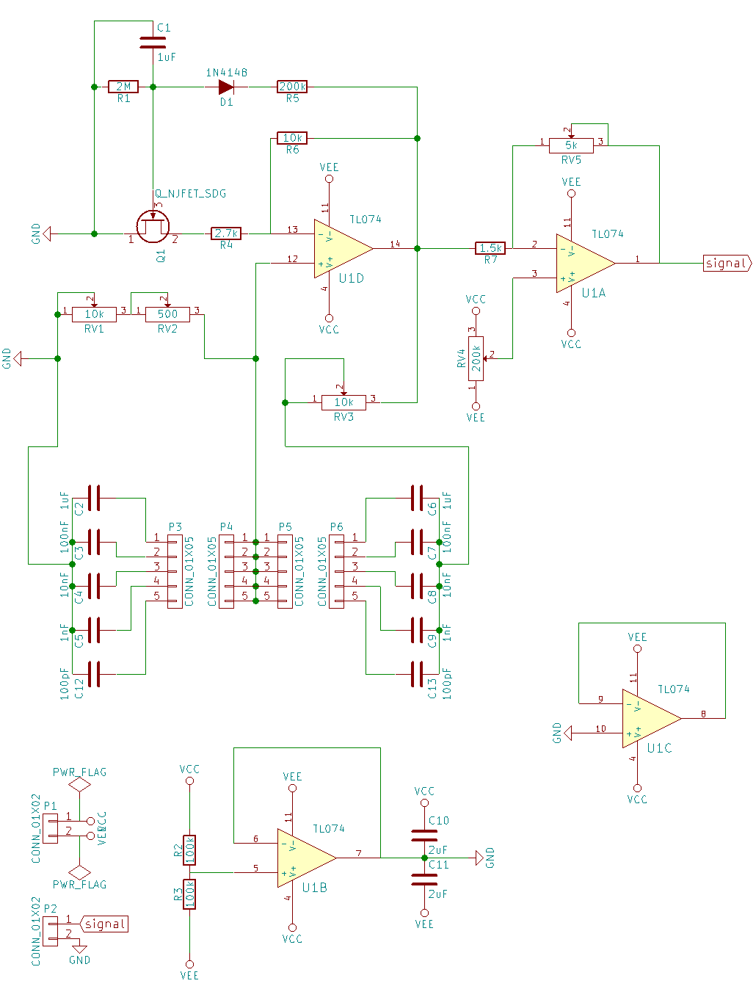
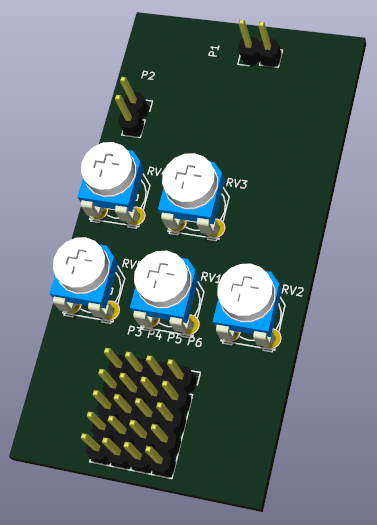
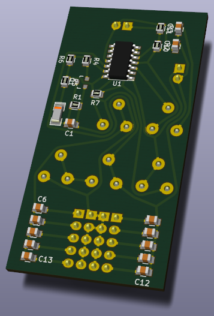
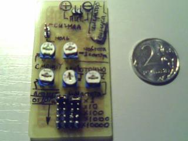

### Wien bridge oscillator (Генератор с мостом Вина)

Details:
https://en.wikipedia.org/wiki/Wien_bridge_oscillator

Repository contains:

* Qucs model
* KiCAD schematic and PCB design
* PCB routing created by TopoR

